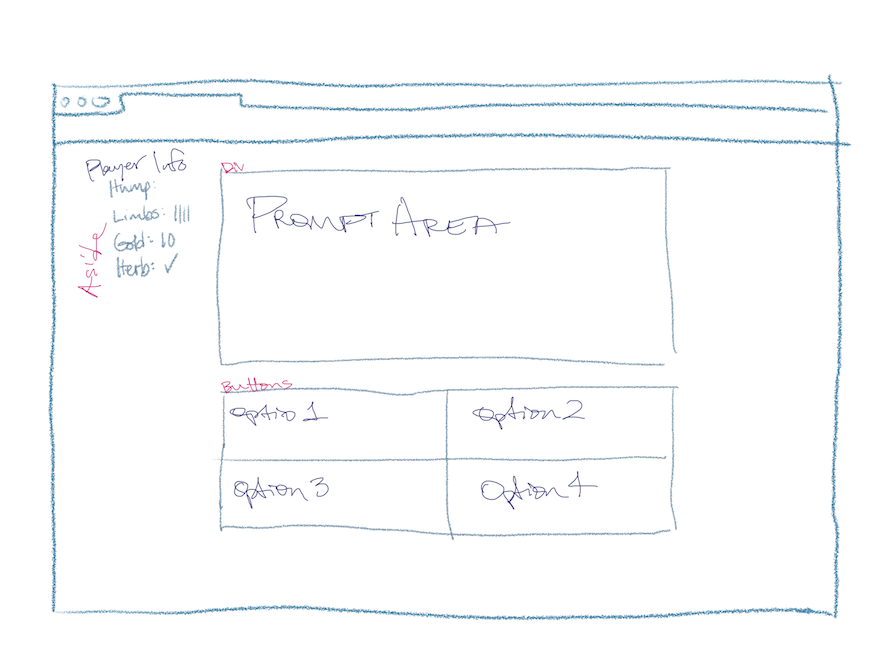

# Project 1 - The Bridge Troll's Toll - Text-Based Adventure (working title)
Click here to play the game:
https://heiner000.github.io/project-1/

## The Story so Far:

Hump is an apprentice to Master Wizard Timothy. Master Timothy has been commissioned by his monarch to brew a special potion, however he lacks the needed ingredients.
There is an herbalist across the bridge who can grow the specific reagents for the brew, but it will take time. Master Timothy will send Hump to fetch the ingredients when they are ready, but each time Hump crosses the bridge he will have to pay the bridge Troll's toll.

The bridge Troll's **toll** must be paid, and he will only be satisfied with **blood and bones!** Unless you can answer his increasingly difficult series of **riddles**, then perhaps he'll let you by this time without a bite.

In this text-based adventure game Hump must answer the troll's riddles correctly to cross the bridge, otherwise he may take a limb. Lose more than 3 limbs and he won't make a very good wizard's apprentice anymore. Answer enough riddles correctly to bring back the required herbs or he'll lose his apprenticeship. 

## Tech Stack:

+ HTML
+ CSS
+ JavaScript
    + DOM Manipulation

## MVP Goals
+ Display a starting screen with instruction button & start button
+ Gameplay screen displays prompt area, option buttons, Hump's limb count, gold, & inventory
+ Prompt area contains Troll's dialogue/riddle
+ 4 buttons of options for possible riddle solutions
+ Decrement Hump's limb count for each riddle missed
+ Display loser screen for 3rd loss & include reset button
+ Display winner screen for 3 riddles solved

## Stretch Goals
+ Set time limit for each answer
+ Randomly populate riddle prompt with riddles pulled from 3 different arrays rated on riddle difficulty
+ Include hard mode where instead of 4 buttons, there's just a form for user's input to answer riddles
+ Wizard difficulty mode: form/no buttons + only pull riddles from hardest array
+ Have additional prompts that allow Hump opportunities to gain or lose gold
+ Enough gold could purchase a distraction allowing Hump to skip a riddle
+ Possible sprites or additional styling

## Potential Roadblocks
+ focus on 'hangman aspect'
+ don't get stuck in busy work until MVP is finished

## Post-Project Reflection

https://heiner000.github.io/project-1/